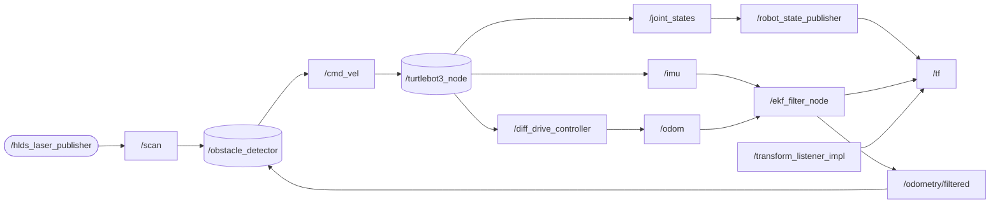

# turtlebot3_burger

### Működés leírása
Turtlebot3 építése ros2 környezetben, valamint akadály kikerülő vezérlés létrehozása lidar segítségével.

### Működést szemléltető gráf



### Működést szemléltető videó

[](https://www.youtube.com/watch?v=eSl_OqyTuD4)

### Felhasznált csomagok
Turtlebot3: Ez a csomag a robot "szíve". Ahhoz, hogy a robot egyátalán mozogni tudjon a bringup-nak futnia kell. Emellett a program készítése során fontos eszközök voltak még a csomagban (pl.: example, teleop).

hls_lfcd_lds_driver: Ez a lidar driver-je. Ennek a segítségével pörög a lidar, és gyűjti az adatokat, ami elengedhetetlen a tájékozódáshoz.

lidar_cluster_ros2: Kiegészítő a lidarhoz. Az egymáshoz közel lévő pontokat egy akadályként definiálja, így megkönnyíti annak kikerülését.

turtlebot3_burger mappa: Ebben a mappában két általunk készített csomag található: obstacle_detector és tb3_localization. Előbbi a haladáshoz és akadálykerüléshez kell, utóbbi pedig létrehoz egy /odometry/filtered topic-ot, ami lényegében /imu segítségével javítja /odom értékeit, és a robotunk ezt a topic-ot használja a navigációhoz.


### Csomagok klónozása

Ha feltételezzük, hogy a munkahelyünk a ros2_ws, akkor lépjünk be a /ros2_ws/src-be, és klónozzuk a csomagokat.

``` r
cd ~/ros2_ws/src
```

Turtlebot3:
``` r
git clone https://github.com/ROBOTIS-GIT/turtlebot3.git
```

Lidar driver (LDS-01):
``` r
git clone https://github.com/ROBOTIS-GIT/hls_lfcd_lds_driver.git
```

lidar_cluster_ros2:
``` r
git clone https://github.com/jkk-research/lidar_cluster_ros2.git
```

turtlebot3_burger mappa:
``` r
git clone https://github.com/LudmanKevin/turtlebot3_burger.git
```

### Csomagok lefordítása

Ha megvagyunk a klónozásokkal, lépjünk vissza a ros2_ws-be, és folytassuk ezen parancsokkal.

``` r
cd ~/ros2_ws/ 
```
``` r
colcon build
```
``` r
source install/setup.bash
```
``` r
ros2 launch obstacle_detector start_robot_and_detector.launch.py
```